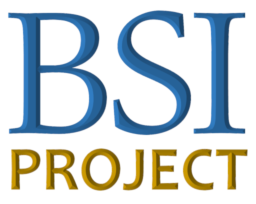
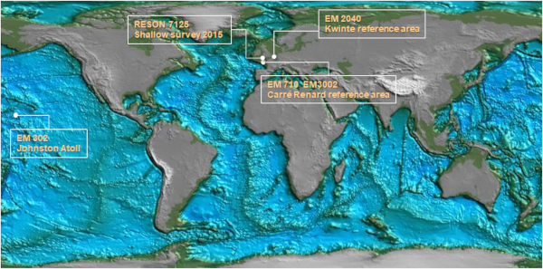

## Welcome!

{: .center-image }

The Baskscatter Software Intercomparison Project (BSIP) is part of 
the [Backscatter Working Group](http://geohab.org/bswg/): established under auspices 
of [GEOHAB](http://geohab.org/) and consisting of more than 300 researchers 
representing academia, governments and industry.

{: .center-image }

***

### Rationale

Although backscatter mosaics of the seafloor are now routinely produced from multibeam sonar data, 
significant differences have been observed in the products generated by different software 
when processing the same dataset. 
This represents a major limitation to a number of possible uses of backscatter mosaics, 
including quantitative analysis, monitoring seafloor change over time, 
and combining results from multiple data sources. 

With the aim of checking the consistency of the processing results provided by 
various software suites, the Baskscatter Software Intercomparison Project (BSIP) was launched in May 2018. 
Software developers were invited to actively participate in BSIP and discuss how the inconsistencies 
might be overcome and, or at least made more transparent. Since backscatter data processing is a complex and (as yet) non-standardized sequence of steps, 
the root causes of observed differences in the end-results derived using different software packages are 
difficult to pinpoint. It is thus necessary to obtain data at intermediate stages of processing sequences. 

We provide software developers with several small [common datasets](#common-datasets) collected 
using different multibeam sonar models and ask them to generate intermediate processing results 
focused on the output of the first stages of processing (i.e., as read by the software tools) 
as well as the fully processed results. 

To date, the developers of four software packages 
([CARIS SIPS](https://www.teledynecaris.com/en/products/hips-and-sips/), 
[MB Process](https://cmst.curtin.edu.au/products/multibeam-software/), 
[QPS FMGT](https://www.qps.nl/fledermaus/), and 
[Sonarscope](http://flotte.ifremer.fr/fleet/Presentation-of-the-fleet/Logiciels-embarques/SonarScope)) 
have actively collaborated on this project and other interested software vendors are encouraged 
to participate in this project. 

***

### Common Datasets

{: .center-image }

* Johnston Atoll: [Kongsberg EM302](https://drive.google.com/drive/folders/1nXSFafWyGbLIKcgV8fV8Wdx1lkbhT85O?usp=sharing)
* Shallow Survey 2015: [Reson 7125](https://drive.google.com/drive/folders/1irpWFcf9n3-f3uqM-aYhGwmSwHoGJ5B4?usp=sharing)
* Kwinte reference area: [Kongsberg EM2040](https://drive.google.com/drive/folders/1hlAeiOeH7tSVDXUFNKk0SOAj_sOhXRra?usp=sharing)
* Carré Reneard reference area: 
  * [Kongsberg EM710](https://drive.google.com/drive/folders/1Cyfw11qCCCR9WN_SDOmI2HZbbBlUg_Tr?usp=sharing) *(license: [CC-BY-NC-SA-4.0](resources/LICENSE_Shom_DATA.txt))*
  * [Kongsberg EM2040C](https://drive.google.com/drive/folders/1jZmQmKzLh3e45WP6ZRiFp1tLEgFVSwEL?usp=sharing) *(license: [CC-BY-NC-SA-4.0](resources/LICENSE_Shom_DATA.txt))*
  * [Kongsberg EM3002](https://drive.google.com/drive/folders/1VYbJwdo7bfPU5-bW7a6n9EZZklw1xxwx?usp=sharing) *(license: [CC-BY-NC-SA-4.0](resources/LICENSE_Shom_DATA.txt))*

*** 

### Outreach

* BSIP on [Research Gate](https://www.researchgate.net/project/Backscatter-Software-Intercomparison-Project). 

#### GeoHab 2018

* Abstract: [*Requesting and Comparing Intermediate Results from Several Backscatter Data Processing Software: A First Step Towards Future Consistency of Multibeam Backscatter Estimation*.](http://ccom.unh.edu/sites/default/files/publications/Schimel_et_al_GeoHab_2018_Requesting_and_Comparing_Intermediate_Results.pdf)

|

#### Shallow Survey 2018


<iframe src="//www.slideshare.net/slideshow/embed_code/key/dTHbhBtWIVrYR6" width="595" height="485" frameborder="0" marginwidth="0" marginheight="0" scrolling="no" style="border:1px solid #CCC; border-width:1px; margin-bottom:5px; max-width: 100%;" allowfullscreen> </iframe>


* Presentation:  [*A First Step Towards Consistency of Multibeam Backscatter Estimation: Requesting and Comparing Intermediate Backscatter Processing Results From Backscatter Processing Software*.](http://dx.doi.org/10.13140/RG.2.2.33443.09767)

|

#### US Hydro 2019


<iframe src="//www.slideshare.net/slideshow/embed_code/key/ttZ4FGPhd6Tz2h" width="595" height="485" frameborder="0" marginwidth="0" marginheight="0" scrolling="no" style="border:1px solid #CCC; border-width:1px; margin-bottom:5px; max-width: 100%;" allowfullscreen></iframe>


* Presentation: [*Preliminary Evaluation of Multibeam Backscatter Consistency through Comparison of Intermediate Processing Results*.](http://dx.doi.org/10.13140/RG.2.2.10948.07043)

|

#### GeoHab 2019

* Presentation: [*BSWG meeting*](http://dx.doi.org/10.13140/RG.2.2.13881.21606)

***

### Project Facilitators

* [Mashkoor Malik (NOAA OER)](mailto:mashkoor.malik@noaa.gov)
* [Giuseppe Masetti (UNH CCOM/JHC)](mailto:gmasetti@ccom.unh.edu)
* [Alexandre Schimel (NIWA)](mailto:Alexandre.Schimel@niwa.co.nz)
* [Marc Roche (FOD Economie)](mailto:Marc.Roche@economie.fgov.be)
* [Margaret Dolan (NGU)](mailto:Margaret.Dolan@ngu.no)
* [Julien Le Deunf (SHOM)](mailto:julian.le.deunf@shom.fr)

{: .center-image }

***

### Project Collaborators

* [CARIS SIPS](https://www.teledynecaris.com/en/products/hips-and-sips/)
* [Curtin MB Process](https://cmst.curtin.edu.au/products/multibeam-software/) 
* [Ifremer Sonarscope](http://flotte.ifremer.fr/fleet/Presentation-of-the-fleet/Logiciels-embarques/SonarScope)
* [QPS FMGT](https://www.qps.nl/fledermaus/)

{: .center-image }
